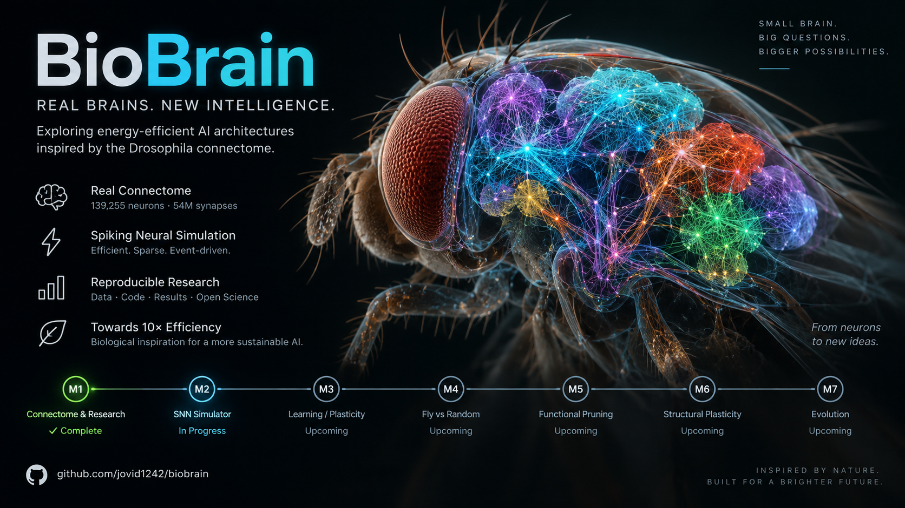

# BioBrain

<p align="center">
  
  <br>
  <sub>Иллюстрация, а не визуализация данных FlyWire.</sub>
</p>

**English summary.** BioBrain is a research project that asks whether the real wiring diagram of the adult
*Drosophila* brain (FlyWire, 139,255 neurons) can serve as the starting architecture for a sparse, event-driven,
trainable spiking neural network that solves AI tasks with far fewer synaptic operations than a suitable
baseline. It is not an LLM, not a Transformer, not an AGI attempt and not a fly simulator. Negative results are
treated as results. **Milestone 1** (official data, validation, graph analysis, memory measurements) and
**Milestone 2** (a minimal LIF simulator running real FlyWire subgraphs of 100–50,000 neurons in time-step and
event-driven modes) are complete. A key M2 finding is negative. With Python + NumPy
on a CPU, event-driven execution is faster than time-step only at extremely sparse activity: up to 6.6× on
100 neurons and 1.2× on 10k, and never on 50k. Synaptic event delivery, not neuron updates, dominates the cost.
**Milestone 2.5** compiled the same model with Numba (bit-identical to NumPy) and ran the full 139,255-neuron
connectome (0.23–1.3 s per simulated second, ≤ 0.33 GiB). Compilation sped up event-driven execution 5–53× and
time-step 1.3–11×, yet at realistic activity compiled event-driven is still ~2× slower than compiled time-step.
The cost is synaptic events, not Python.

---

## Что мы делаем

Коннектом дрозофилы — первая полная карта мозга взрослого животного с синаптическим разрешением: 139,255 нейронов
и ~54.5 млн синапсов между ними. Эволюция «спроектировала» эту сеть для очень экономной работы. Вопрос проекта:

> **Можно ли, используя принципы реальной биологической нейронной архитектуры, построить искусственную обучаемую
> event-driven систему, которая решает полезные задачи при значительно меньших вычислительных затратах?**

Мы **не** предполагаем, что ответ «да». Долгосрочная цель — примерно 10× меньше synaptic operations / памяти при
сопоставимом качестве на конкретных задачах, но это цель эксперимента, а не заранее известный факт.

## Гипотезы (каждая может быть опровергнута)

| | гипотеза | «да» означает | «нет» означает |
|---|---|---|---|
| **H1** | Топология реального коннектома даёт полезные вычислительные свойства по сравнению со случайной и перемешанной топологией при равном бюджете ресурсов | коннектом лучше **degree-preserving** null-моделей при одинаковых входах/выходах, инициализации и подборе гиперпараметров | выигрыш объясняется статистикой степеней/весов, а не конкретной проводкой — или его нет вовсе |
| **H2** | Сеть можно сильно уменьшить функциональным pruning без потери качества на наборе задач | крупные части удаляются лучше, чем при **случайном** pruning той же разреженности | pruning не лучше случайного, или качество падает |
| **H3** | Разреженная event-driven fly-архитектура достигает сопоставимого качества с меньшим числом synaptic operations / обращений к памяти | меньше операций при том же качестве и одинаковом формате хранения | операций столько же или больше |

Энергию мы не заявляем, пока она не измерена инструментально: до этого публикуются только счётчики операций.

## Что может получиться

1. **Топология помогает** даже против строгих null-моделей → биологические мотивы связности становятся
   архитектурным prior-ом, который можно сжимать (pruning) и переносить.
2. **Помогает только статистика**, а не конкретная проводка (преимущество исчезает на degree-preserving null) →
   полезный рецепт — генерировать синтетические графы с такими же распределениями, коннектом больше не нужен.
3. **Помогает устойчивости, а не точности** (к шуму, повреждениям, гиперпараметрам) — так чаще всего и было
   в предыдущих работах.
4. **Не помогает или мешает** → честный отрицательный результат. Инструменты при этом остаются полезными:
   валидированное компактное хранилище коннектома, анализатор графа, event-driven симулятор и набор бенчмарков
   со строгими контролями.

Что говорит литература заранее (подробно — [`docs/RESEARCH.md`](docs/RESEARCH.md)): в известных работах «преимущество
коннектома» обычно исчезало или сжималось до нескольких процентов при строгих контролях; проверки на графе
FlyWire с синаптическим разрешением, спайковыми нейронами и мультизадачным бенчмарком не найдено.

## Что уже измерено (Milestone 1)

Полный отчёт — [`docs/MILESTONE1_REPORT.md`](docs/MILESTONE1_REPORT.md), числа — [`docs/RESULTS.md`](docs/RESULTS.md).

- **Данные сверены до синапса:** 139,255 нейронов, 54,492,922 синапса, 15,091,983 связанных пары, 2,700,513 пар
  ≥ 5 синапсов — точно как в первоисточниках (валидация: 38 PASS, 0 FAIL, 3 WARN с объяснением).
- **Весь мозг как граф занимает 87 MiB** (CSR, 6 байт на связь); наивные Python-объекты стоили бы 1.8–3.7 GiB.
- **Граф далёк от случайного даже при тех же степенях:** взаимные связи в 46 раз чаще, clustering в 8 раз выше,
  модульность 0.71 против 0.13, замкнутые и взаимные тройки нейронов в 2–500 раз чаще; открытые цепочки — реже.
  Это совпадает с опубликованным анализом Lin et al. 2024.
- **Не подтвердилось:** выраженный «rich club» (есть лишь ≤ 3 % обогащения на средних степенях).
- **Ограничение данных:** выходы нейронов в графе недоучтены примерно вдвое (прикреплено лишь 44.7 % постсинапсов).

Эти результаты ещё ничего не говорят о H1–H3: они описывают структуру, а не вычисления.

## Что измерено в Milestone 2

Полный отчёт — [`docs/MILESTONE2_REPORT.md`](docs/MILESTONE2_REPORT.md), числа — [`docs/M2_RESULTS.md`](docs/M2_RESULTS.md),
ограничения — [`docs/M2_LIMITATIONS.md`](docs/M2_LIMITATIONS.md). Модель: current-based LIF, все её параметры,
кроме числа синапсов и медиатора, — допущения.

- **Движок работает на реальной проводке** от 100 до 50,000 нейронов (7.6 млн рёбер) в двух режимах одной модели.
  Спайки режимов совпадают во всех 300 коротких проверках (80 — растр в растр, 220 пар бенчмарков — по числу
  спайков); в float64 растры идентичны и на 40,000 шагах.
  Длинные прогоны в float32 расходятся из-за округления.
- **Отрицательный результат:** в NumPy event-driven быстрее time-step только при очень редкой активности —
  ≲ 0.015–0.12 приходящих событий на нейрон за шаг. Лучшее ускорение: 6.6× (100 нейронов), 3.0× (1k),
  1.22× (10k); на 50k перелома нет. При входе 1 % event-driven медленнее в 2.5–13 раз.
- **Стоимость определяют синапсы, а не нейроны:** на доставку событий уходит 54–94 % шага time-step.
- **Память не ограничение:** 8–12 байт на нейрон, 50k нейронов — ≤ 507 MiB на процесс. Полный мозг, по
  оценке (ESTIMATE, не запускался), займёт ≈ 0.2 GiB.
- **Динамику определяют допущения:** один знак глутамата переводит сеть из устойчивого режима в насыщение.
- Энергия **не измерялась**: доступная без root оценка ОС повторяет время CPU.

M2 тоже не проверяет H1–H3: это движок и замеры, обучения и задач ещё нет.

## Что измерено в Milestone 2.5

Отчёт — [`docs/MILESTONE25_REPORT.md`](docs/MILESTONE25_REPORT.md), план с критериями до кода —
[`docs/MILESTONE25_PLAN.md`](docs/MILESTONE25_PLAN.md).

- **Та же модель, скомпилированная Numba (CPU, один поток),** побитово совпадает с NumPy: растры, счётчики,
  потенциалы — в float32 и float64, до 40,000 шагов и на полном мозге.
- **Компиляция ускорила time-step в 1.3–11 раз, event-driven — в 5–53 раза.** Но при реалистичной активности
  скомпилированный event-driven всё равно ≈ в 2 раза медленнее скомпилированного time-step (исход C). Выигрывает
  он только при очень редкой активности на 1k–10k (до 28×).
- **Узкое место — доставка синаптических событий** (≈ 0.6–1.8 нс на событие, растёт с размером сети). Даже
  идеальная event-driven реализация на CPU при этой связности была бы быстрее не более чем в 1.1–1.9× (50k и
  полный мозг).
- **Полный коннектом (139,255 нейронов) запущен на ноутбуке:** 0.23–1.3 с на секунду модели, peak RSS
  268–327 MiB (сборка сети — 935 MiB). На калиброванном gain активность самоподдерживается (4–15 Гц).
- **Рекомендация по данным:** переходить к M3 с compiled time-step как основным движком.

M2.5 сравнивает только способы исполнения одной модели. Энергию, эффективность топологии или сравнение с другим
AI он не проверяет.

## Дорожная карта

| этап | содержание | статус |
|---|---|---|
| **M1** | официальные данные, воспроизводимая загрузка, валидация, компактный граф, анализатор, замеры памяти | **завершён** 2026-09-17 |
| **M2** | минимальный SNN-симулятор: 100 → 1k → 10k → 50k нейронов; event-driven против time-step (бенчмарком) | **завершён** 2026-09-17 |
| **M2.5** | компилируемый backend (Numba) и проверка на полном коннектоме | **завершён** 2026-09-17, ждёт решения владельца |
| M3 | первая правило пластичности; обучение простой temporal/pattern задаче; checkpoint → restart → навык сохранён | |
| M4 | Fly topology vs random vs shuffled при одинаковом бюджете | |
| M5 | функциональная ablation и pruning на мультизадачном бенчмарке | |
| M6 | структурная пластичность (добавление/удаление синапсов) | |
| M7 | добавление/удаление нейронов, эволюция архитектур, few-shot | |

Язык и символы — только после всего этого.

## Данные

FlyWire FAFB, materialization 783 (Dorkenwald et al. 2024; Schlegel et al. 2024). Скачиваются командой
`biobrain download` из [Zenodo 10676866](https://doi.org/10.5281/zenodo.10676866) и
[flywire_annotations](https://github.com/flyconnectome/flywire_annotations) (~1.1 GiB, все файлы сверяются с
официальными checksum). **Данные не хранятся в репозитории** и распространяются по условиям FlyWire (CC BY-NC 4.0).
Подробно — [`docs/DATASET.md`](docs/DATASET.md).

## Быстрый старт

Нужен Python ≥ 3.12, ~2 GB диска и ≥ 8 GB RAM.

```bash
make setup                      # .venv с точными версиями из requirements.lock
.venv/bin/biobrain download     # ~1.1 GiB, с проверкой md5 / git blob SHA-1
.venv/bin/biobrain preprocess   # компактный граф: CSR + CSC + аннотации
.venv/bin/biobrain validate     # results/data_validation.md
.venv/bin/biobrain analyze      # results/analysis/flywire_fafb_v783/REPORT.md
.venv/bin/biobrain bench-memory # results/memory/memory_benchmark.json
.venv/bin/biobrain neuron 720575940628857210   # один нейрон: тип, регион, партнёры
make test
```

Все тяжёлые команды принимают `--memory-budget 8GB`. Эксперименты Milestone 2 запускаются по шагам
(`.venv/bin/biobrain m2 calibrate`, `bench`, `figures`, …); полный порядок — `docs/M2_RESULTS.md`, раздел 13.

## Документы

| документ | о чём |
|---|---|
| [docs/MILESTONE25_REPORT.md](docs/MILESTONE25_REPORT.md) | итоговый отчёт Milestone 2.5: компиляция, полный коннектом, Q1–Q15 |
| [docs/MILESTONE2_REPORT.md](docs/MILESTONE2_REPORT.md) | итоговый отчёт Milestone 2: статус, чек-лист, главная таблица |
| [docs/M2_RESULTS.md](docs/M2_RESULTS.md) · [docs/M2_LIMITATIONS.md](docs/M2_LIMITATIONS.md) | результаты M2 с ответами на вопросы · ограничения |
| [docs/SIMULATOR.md](docs/SIMULATOR.md) · [docs/PERFORMANCE_PLAN.md](docs/PERFORMANCE_PLAN.md) | модель и два режима движка · измеренные узкие места и варианты backend |
| [docs/MILESTONE1_REPORT.md](docs/MILESTONE1_REPORT.md) | итоговый отчёт Milestone 1 |
| [results/analysis/flywire_fafb_v783/REPORT.md](results/analysis/flywire_fafb_v783/REPORT.md) | сгенерированный отчёт анализатора: таблицы, графики, стоимость шагов |
| [results/data_validation.md](results/data_validation.md) | все проверки данных с источниками |
| [docs/RESEARCH.md](docs/RESEARCH.md) | датасеты, определения, числа из статей, ограничения, предшествующие работы |
| [docs/DATASET.md](docs/DATASET.md) | что именно скачано и что измерено |
| [docs/MEMORY.md](docs/MEMORY.md) | сколько памяти стоит граф в разных представлениях |
| [docs/ARCHITECTURE.md](docs/ARCHITECTURE.md) | устройство кода и формата данных |
| [docs/ASSUMPTIONS.md](docs/ASSUMPTIONS.md) | наблюдения vs решения обработки vs допущения модели |
| [docs/DECISIONS.md](docs/DECISIONS.md) | журнал решений |
| [docs/EXPERIMENTS.md](docs/EXPERIMENTS.md) | правила экспериментов и протокол честного сравнения |
| [docs/LAB_NOTES.md](docs/LAB_NOTES.md) | научный журнал |
| [docs/RESULTS.md](docs/RESULTS.md) | результаты (RESULT отдельно от INTERPRETATION) |
| [docs/MILESTONE1_PLAN.md](docs/MILESTONE1_PLAN.md) · [docs/MILESTONE2_PLAN.md](docs/MILESTONE2_PLAN.md) | планы, написанные до экспериментов |

## Лицензии и цитирование

Код — MIT (см. `LICENSE`). Данные FlyWire — по условиям FlyWire (CC BY-NC 4.0); при использовании цитируйте
Dorkenwald et al. 2024 (doi:10.1038/s41586-024-07558-y), Schlegel et al. 2024 (doi:10.1038/s41586-024-07686-5),
Buhmann et al. 2021, Heinrich et al. 2018, Eckstein et al. 2024, Zheng et al. 2018 — полный список в
`catalog/flywire_fafb_v783.toml`.
