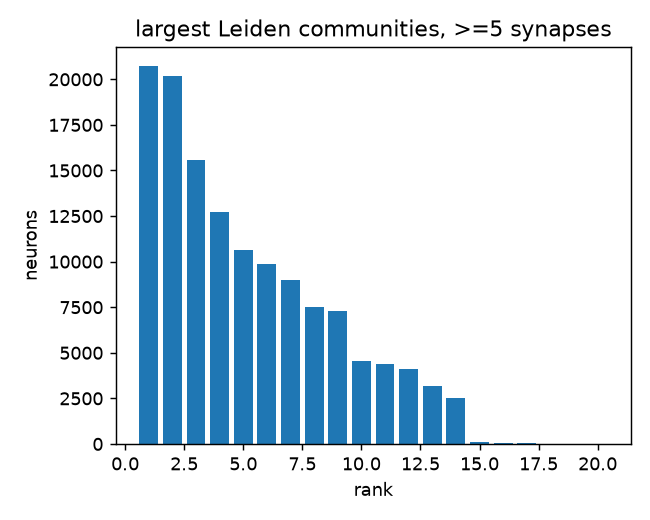
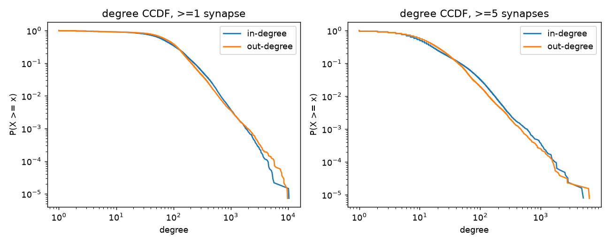
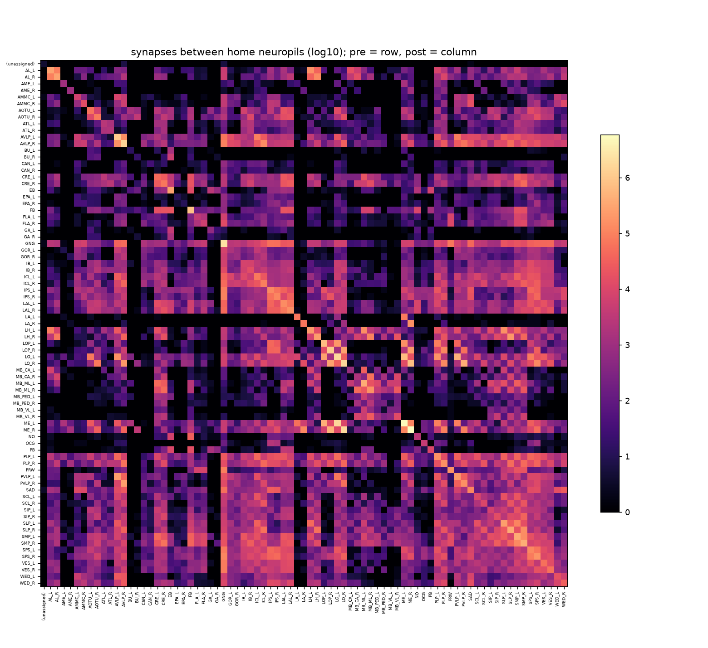
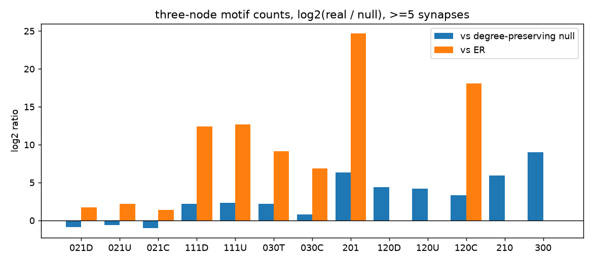
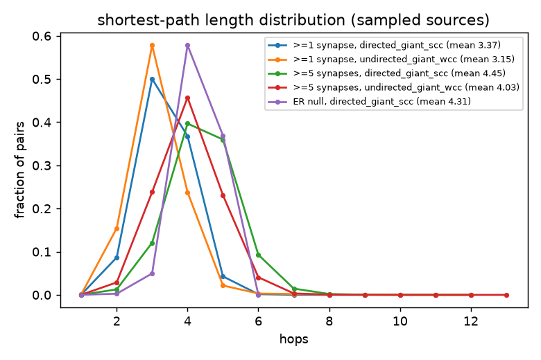
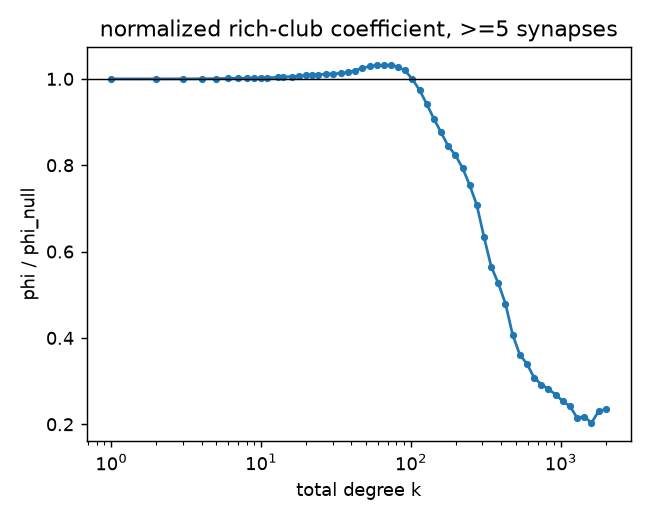
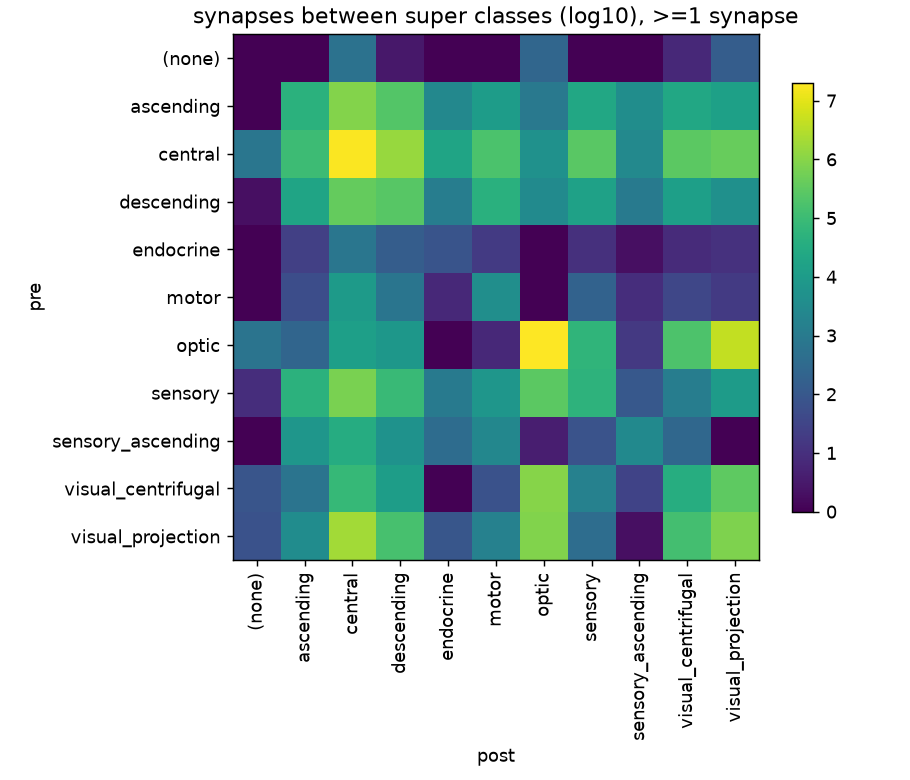
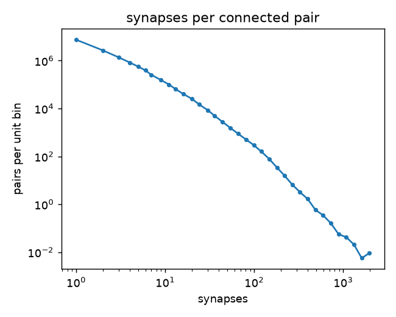

# Connectome analysis — flywire_fafb_v783

Annotations v3.1.0 · commit `063d2bef5e507ede42f32fdec1d4aea8d4174645` · Apple M5, 16.0 GiB RAM · 2150 s · peak RSS 3.1 GiB (budget 8.0 GiB) · seed 20260916

All numbers are generated by `biobrain analyze`; nothing in this file is edited by hand. Self-connections are excluded from every graph statistic (0 self-connection pairs dropped).

## Graph overview

| metric | >=1 synapse | >=5 synapses |
|---|---:|---:|
| neurons | 139,255 | 139,255 |
| connections (ordered pairs) | 15,091,983 | 2,700,513 |
| synapses | 54,492,922 | 34,153,566 |
| density | 0.0007783 | 0.0001393 |
| neurons with >= 1 connection | 138,639 | 134,181 |
| reciprocity P(j->i \| i->j) | 0.266 | 0.1398 |
| reciprocity / ER expectation | 341.8 | 1,004 |
| reciprocity / degree-preserving expectation (analytic) | 42.77 | 33.75 |
| neurons with a reciprocal partner | 131,881 | 81,245 |
| largest WCC (share of all neurons) | 0.9918 | 0.9514 |
| largest SCC (share of all neurons) | 0.9723 | 0.86 |
| largest SCC (share of neurons with edges) | 0.9767 | 0.8925 |
| weak components / strong components | 705 / 3,240 | 5,318 / 19,411 |
| global clustering (undirected view) | 0.09874 | 0.04476 |
| mean directed path length, giant SCC | 3.371 | 4.452 |
| max observed directed path length | 9 | 12 |
| mean undirected path length, giant WCC | 3.15 | 4.029 |
| in/out degree Pearson (intrinsic neurons) | 0.819 | 0.7573 |
| median in / out degree (intrinsic neurons) | 79 / 90 | 11 / 13 |
| mean in degree (intrinsic neurons) | 122.4 | 21.67 |
| max in / out degree (all) | 10,356 / 9,783 | 5,080 / 6,399 |
| in-degree Gini (all neurons) | 0.5326 | 0.6467 |
| share of total degree held by the top 1 % of neurons | 0.1003 | 0.1424 |

Path lengths use sampled sources (see `summary.json` for the sample size and the standard error).

## Published reference values (for comparison, not for tuning)

| quantity | published | source |
|---|---|---|
| connections >= 5 synapses | 2,700,513 | Dorkenwald et al. 2024, Nature 634:124 (release 783) |
| density (>= 5) | 0.000161 (text) / 0.000160 (Table 2) | Lin et al. 2024, Nature 634:153 (release 630, pairs >= 5 synapses) |
| reciprocity (>= 5) | 0.138 | Lin et al. 2024, Nature 634:153 (release 630, pairs >= 5 synapses) |
| reciprocity (>= 1) | 0.2655 (repository code output) | Lin et al. 2024, Nature 634:153 (release 630, pairs >= 5 synapses) |
| reciprocity ratio to ER / to degree-preserving null (>= 5) | x858 / x43.8 | Lin et al. 2024, Nature 634:153 (release 630, pairs >= 5 synapses) |
| neurons with a reciprocal partner (>= 5) | 77,607 of 127,978 | Lin et al. 2024, Nature 634:153 (release 630, pairs >= 5 synapses) |
| global clustering (>= 5) | 0.0477 (text) / 0.0463 (Table 2) | Lin et al. 2024, Nature 634:153 (release 630, pairs >= 5 synapses) |
| clustering ratio to ER / to degree-preserving null | x144 / x7.57 | Lin et al. 2024, Nature 634:153 (release 630, pairs >= 5 synapses) |
| largest SCC / WCC | 93.3 % / 98.8 % of neurons | Lin et al. 2024, Nature 634:153 (release 630, pairs >= 5 synapses) |
| mean path length: directed in giant SCC / undirected in giant WCC | 4.42 / 3.91 hops | Lin et al. 2024, Nature 634:153 (release 630, pairs >= 5 synapses) |
| small-worldness S_delta | 141 | Lin et al. 2024, Nature 634:153 (release 630, pairs >= 5 synapses) |
| rich-club cut-off (total degree) / neurons above | 37 / 40,218 | Lin et al. 2024, Nature 634:153 (release 630, pairs >= 5 synapses) |
| intrinsic neurons: median in / out degree (>= 5) | 11 / 13 | Dorkenwald et al. 2024, Nature 634:124 (release 783) |
| intrinsic neurons: in/out degree Pearson R | 0.76 | Lin et al. 2024, Nature 634:153 (release 630, pairs >= 5 synapses) |

## Null models (>=5 synapses)

degree-preserving nulls keep every in- and out-degree; 5 samples (Lin et al. used 100), so z-scores are indicative only

| quantity | real | ER | degree-preserving (mean ± sd) |
|---|---:|---:|---:|
| reciprocity | 0.1398 | 0.0001355 | 0.003052 ± 4.775e-05 |
| clustering | 0.04476 | 0.0002775 | 0.005626 ± 2.279e-05 |

Small-worldness S_delta = **156.3** (C/C_ER = 161.3, L/L_ER = 1.032); (C / C_ER) / (L / L_ER), C = global clustering of the undirected view, L = mean directed path length in the giant SCC.

### Three-node motifs (triad census, MAN notation; 030T = feed-forward loop, 030C = 3-cycle)

| motif | real | ER | null mean | real / null | real / ER | z (null) |
|---|---:|---:|---:|---:|---:|---:|
| 021D | 88,864,477 | 26,177,461 | 159,190,487 | 0.558 | 3.39 | -516 |
| 021U | 121,117,155 | 26,168,530 | 184,980,510 | 0.655 | 4.63 | -433 |
| 021C | 134,787,052 | 52,326,005 | 265,677,397 | 0.507 | 2.58 | -457 |
| 111D | 38,487,364 | 7,040 | 8,265,954 | 4.66 | 5,467 | 216 |
| 111U | 45,889,268 | 7,068 | 9,242,752 | 4.96 | 6,493 | 283 |
| 030T | 4,048,329 | 7,266 | 878,040 | 4.61 | 557 | 531 |
| 030C | 289,036 | 2,417 | 165,050 | 1.75 | 120 | 77.8 |
| 201 | 26,566,403 | 1 | 329,663 | 80.6 | 26,566,403 | 2,445 |
| 120D | 706,365 | 0 | 34,028 | 20.8 | — | 754 |
| 120U | 750,733 | 0 | 40,848 | 18.4 | — | 965 |
| 120C | 568,315 | 2 | 55,987 | 10.2 | 284,158 | 449 |
| 210 | 578,394 | 0 | 9,451 | 61.2 | — | 1,528 |
| 300 | 177,055 | 0 | 341 | 520 | — | 6,135 |

Rich club (normalized coefficient > 1.01 (Lin et al. 2024 criterion); points with N_k >= 10): above the criterion for total degree 24–91 (contiguous: True); first crossing k = 24 with 61,461 neurons above it; maximum 1.032 at k = 73; back below 1 from k = 102; lowest 0.203 at k = 1601 (52 neurons). A value below 1 means the highest-degree neurons connect to each other less than the degree-preserving null predicts.

## Communities (>=5 synapses)

Leiden, modularity (resolution 1), undirected, weight = synapses both directions: modularity **0.7120**, 272 communities (stopped: gain < 0.0001; 4 iterations). Largest: [20723, 20172, 15551, 12696, 10628, 9879, 9016, 7521, 7297, 4558].

- agreement with home neuropil: NMI 0.539, ARI 0.262
- agreement with super class: NMI 0.308, ARI 0.153
- modularity of the home-neuropil partition itself: 0.4733; of the super-class partition: 0.3680
- unweighted Leiden, real vs degree-preserving null: 0.6979 vs 0.1263

| community | neurons | top_super_class | top_home_neuropil |
|---|---|---|---|
| 0 | 20,723 | optic 88%, sensory 7%, visual_projection 4% | ME_R 42%, LOP_R 32%, LO_R 16% |
| 6 | 20,172 | optic 92%, sensory 5%, visual_projection 3% | ME_L 49%, LOP_L 28%, LO_L 17% |
| 4 | 15,551 | central 85%, sensory 15%, ascending 0% | MB_ML_L 16%, MB_ML_R 13%, SLP_R 10% |
| 5 | 12,696 | optic 90%, sensory 9%, visual_projection 1% | ME_L 62%, LO_L 18%, LOP_L 11% |
| 12 | 10,628 | central 69%, visual_projection 12%, ascending 7% | GNG 16%, SPS_R 8%, SMP_L 6% |
| 11 | 9,879 | optic 75%, visual_projection 15%, central 5% | ME_L 49%, LO_L 39%, PLP_L 4% |
| 1 | 9,016 | optic 72%, visual_projection 15%, sensory 8% | ME_R 55%, LO_R 33%, PLP_R 5% |
| 2 | 7,521 | optic 88%, sensory 11%, visual_projection 1% | ME_R 67%, LO_R 19%, LA_R 11% |
| 3 | 7,297 | optic 89%, sensory 9%, visual_projection 2% | ME_R 66%, LO_R 20%, LA_R 8% |
| 17 | 4,558 | sensory 41%, central 37%, ascending 9% | GNG 74%, PRW 12%, SMP_R 5% |
| 13 | 4,367 | central 50%, visual_projection 23%, optic 22% | AVLP_L 32%, LO_L 24%, PVLP_L 22% |
| 16 | 4,108 | central 58%, visual_projection 24%, optic 12% | AVLP_R 41%, PVLP_R 20%, LO_R 14% |
| 19 | 3,201 | central 96%, visual_projection 4%, optic 0% | FB 61%, EB 12%, SMP_L 5% |
| 9 | 2,498 | central 60%, sensory 28%, descending 6% | SAD 30%, AMMC_R 12%, GNG 10% |
| 209 | 81 | sensory 59%, optic 41% | LA_L 100% |

## Regions (>=1 synapse)

Home neuropil rule: home neuropil = the neuropil holding most of the neuron's presynapses (all partners, incl. fragments), as in Lin et al. 2024's neuropil blocks; neurons without presynapses fall back to their postsynapses. Assigned from presynapses: 138,636; postsynapse fallback: 334; unassigned: 285.

Synapses whose pre and post neuron share a home neuropil: **50.9%**.

Strongest projections between different home neuropils:

| from | to | synapses | connections |
|---|---|---|---|
| ME_R | LO_R | 1,803,785 | 619,625 |
| ME_L | LO_L | 1,663,690 | 592,722 |
| LO_R | ME_R | 707,474 | 323,469 |
| LO_L | ME_L | 649,752 | 313,453 |
| ME_R | LOP_R | 492,850 | 138,629 |
| LO_L | PVLP_L | 463,397 | 140,393 |
| ME_L | LOP_L | 448,755 | 123,994 |
| LO_R | PVLP_R | 414,826 | 120,006 |
| LO_R | LOP_R | 286,388 | 83,407 |
| LOP_R | LO_R | 277,179 | 112,934 |
| LO_L | LOP_L | 274,420 | 76,027 |
| PVLP_L | AVLP_L | 262,251 | 49,975 |
| PVLP_R | AVLP_R | 251,333 | 45,085 |
| LOP_R | ME_R | 226,642 | 79,100 |
| LO_R | AVLP_R | 202,638 | 43,186 |
| LH_R | SLP_R | 199,814 | 62,777 |
| LOP_L | LO_L | 199,410 | 88,718 |
| LO_L | PLP_L | 175,572 | 69,980 |
| AVLP_R | AVLP_L | 168,013 | 43,925 |
| AL_L | LH_L | 163,245 | 18,364 |

Super classes — share of neurons vs share of incoming synapses (`tables/super_class_flow.csv`):

| super_class | neurons | neuron_share | synapses_in | synapses_out | synapse_in_share | synapses_in_per_neuron |
|---|---|---|---|---|---|---|
| (no annotation) | 14 | 0.0001 | 1553 | 952 | 3e-05 | 110.9 |
| ascending | 1750 | 0.01257 | 230676 | 1227099 | 0.00423 | 131.8 |
| central | 32383 | 0.23254 | 22510645 | 21170126 | 0.41309 | 695.1 |
| descending | 1303 | 0.00936 | 2213351 | 730604 | 0.04062 | 1698.7 |
| endocrine | 80 | 0.00057 | 24045 | 1039 | 0.00044 | 300.6 |
| motor | 110 | 0.00079 | 244929 | 14569 | 0.00449 | 2226.6 |
| optic | 77537 | 0.5568 | 22310883 | 24798676 | 0.40943 | 287.7 |
| sensory | 16904 | 0.12139 | 426109 | 1181213 | 0.00782 | 25.2 |
| sensory_ascending | 612 | 0.00439 | 10494 | 51079 | 0.00019 | 17.1 |
| visual_centrifugal | 524 | 0.00376 | 668014 | 1372685 | 0.01226 | 1274.8 |
| visual_projection | 8038 | 0.05772 | 5852223 | 3944880 | 0.10739 | 728.1 |

## Hubs by in degree (>=1 synapse)

| root_id | cell_type | super_class | side | home_neuropil | in_degree |
|---|---|---|---|---|---|
| 720,575,940,626,979,621 | CT1 | optic | left | LO_R | 10,356 |
| 720,575,940,628,908,548 | CT1 | optic | right | LO_L | 10,182 |
| 720,575,940,636,543,668 | MeMe_e13 | optic | right | ME_L | 5,684 |
| 720,575,940,625,952,755 | Li33 | optic | right | LO_L | 5,432 |
| 720,575,940,626,403,917 | MeMe_e13 | optic | left | ME_R | 5,349 |
| 720,575,940,622,523,508 | Li31 | optic | right | LO_L | 5,265 |
| 720,575,940,627,497,244 | Li33 | optic | left | LO_R | 5,134 |
| 720,575,940,640,851,363 | Li31 | optic | left | LO_R | 4,762 |
| 720,575,940,629,513,222 | Am1 | optic | left | LOP_L | 4,627 |
| 720,575,940,623,888,397 | Pm14 | optic | right | ME_R | 4,571 |
| 720,575,940,623,499,132 | Pm14 | optic | right | ME_R | 4,557 |
| 720,575,940,628,307,026 | Am1 | optic | right | LOP_R | 4,518 |
| 720,575,940,621,116,807 | LT33 | optic | left | LO_R | 4,493 |
| 720,575,940,631,306,284 | LT33 | optic | right | LO_L | 4,398 |
| 720,575,940,611,563,310 | Sm42 | optic | right | ME_R | 4,268 |
| 720,575,940,623,444,044 | Sm42 | optic | left | ME_L | 3,924 |
| 720,575,940,626,039,996 | Pm14 | optic | left | ME_L | 3,837 |
| 720,575,940,634,612,194 | LPi15 | optic | right | LOP_R | 3,742 |
| 720,575,940,621,393,172 | Pm14 | optic | left | ME_L | 3,683 |
| 720,575,940,618,554,041 | Sm41 | optic | right | ME_R | 3,642 |

## Hubs by out degree (>=1 synapse)

| root_id | cell_type | super_class | side | home_neuropil | out_degree |
|---|---|---|---|---|---|
| 720,575,940,628,908,548 | CT1 | optic | right | LO_L | 9,783 |
| 720,575,940,626,979,621 | CT1 | optic | left | LO_R | 9,610 |
| 720,575,940,628,038,808 | cM15 | visual_centrifugal | left | ME_R | 8,454 |
| 720,575,940,628,307,026 | Am1 | optic | right | LOP_R | 8,445 |
| 720,575,940,631,190,016 | cM15 | visual_centrifugal | right | ME_L | 7,787 |
| 720,575,940,629,513,222 | Am1 | optic | left | LOP_L | 7,731 |
| 720,575,940,625,952,755 | Li33 | optic | right | LO_L | 7,453 |
| 720,575,940,627,497,244 | Li33 | optic | left | LO_R | 7,283 |
| 720,575,940,632,777,320 | OA-AL2b2 | visual_centrifugal | right | ME_R | 6,153 |
| 720,575,940,613,065,130 | cL21 | visual_centrifugal | right | LO_R | 5,798 |
| 720,575,940,626,044,942 | OA-AL2b2 | visual_centrifugal | right | ME_R | 5,784 |
| 720,575,940,618,444,473 | cL21 | visual_centrifugal | left | LO_L | 5,759 |
| 720,575,940,625,049,781 | cL21 | visual_centrifugal | left | LO_L | 5,754 |
| 720,575,940,627,996,285 | OA-AL2b2 | visual_centrifugal | left | ME_L | 5,683 |
| 720,575,940,625,525,740 | OA-AL2b2 | visual_centrifugal | left | ME_L | 5,630 |
| 720,575,940,635,684,762 | cL21 | visual_centrifugal | right | LO_R | 5,544 |
| 720,575,940,620,008,758 | LPi13 | optic | right | LOP_R | 5,148 |
| 720,575,940,614,710,509 | cML01 | visual_centrifugal | right | ME_R | 5,045 |
| 720,575,940,622,516,852 | OA-AL2i1 | visual_centrifugal | right | ME_R | 5,044 |
| 720,575,940,626,403,917 | MeMe_e13 | optic | left | ME_R | 4,581 |

## Hubs by in synapses (>=1 synapse)

| root_id | cell_type | super_class | side | home_neuropil | in_synapses |
|---|---|---|---|---|---|
| 720,575,940,626,979,621 | CT1 | optic | left | LO_R | 69,948 |
| 720,575,940,628,908,548 | CT1 | optic | right | LO_L | 68,400 |
| 720,575,940,624,547,622 | APL | central | left | MB_ML_L | 68,332 |
| 720,575,940,613,583,001 | APL | central | right | MB_CA_R | 63,780 |
| 720,575,940,620,975,696 | DPM | central | left | MB_ML_L | 50,943 |
| 720,575,940,634,612,194 | LPi15 | optic | right | LOP_R | 49,946 |
| 720,575,940,625,934,094 | DPM | central | right | MB_ML_R | 41,525 |
| 720,575,940,619,991,862 | LPi15 | optic | left | LOP_L | 38,506 |
| 720,575,940,627,497,244 | Li33 | optic | left | LO_R | 38,080 |
| 720,575,940,625,952,755 | Li33 | optic | right | LO_L | 37,421 |
| 720,575,940,628,307,026 | Am1 | optic | right | LOP_R | 36,672 |
| 720,575,940,650,935,673 | Li32 | optic | right | LO_R | 31,338 |
| 720,575,940,640,736,371 | Li30 | optic | right | LO_R | 30,584 |
| 720,575,940,628,069,501 | Li32 | optic | left | LO_L | 29,743 |
| 720,575,940,633,305,681 | Li30 | optic | left | LO_L | 29,449 |
| 720,575,940,629,513,222 | Am1 | optic | left | LOP_L | 28,515 |
| 720,575,940,627,190,556 | LPi14 | optic | right | LOP_R | 27,404 |
| 720,575,940,632,504,874 | LPi14 | optic | right | LOP_R | 27,079 |
| 720,575,940,611,563,310 | Sm42 | optic | right | ME_R | 26,195 |
| 720,575,940,620,008,758 | LPi13 | optic | right | LOP_R | 25,778 |

## Hubs by out synapses (>=1 synapse)

| root_id | cell_type | super_class | side | home_neuropil | out_synapses |
|---|---|---|---|---|---|
| 720,575,940,628,908,548 | CT1 | optic | right | LO_L | 99,871 |
| 720,575,940,626,979,621 | CT1 | optic | left | LO_R | 98,624 |
| 720,575,940,624,547,622 | APL | central | left | MB_ML_L | 60,103 |
| 720,575,940,613,583,001 | APL | central | right | MB_CA_R | 50,681 |
| 720,575,940,627,497,244 | Li33 | optic | left | LO_R | 47,851 |
| 720,575,940,625,952,755 | Li33 | optic | right | LO_L | 47,162 |
| 720,575,940,634,612,194 | LPi15 | optic | right | LOP_R | 35,806 |
| 720,575,940,620,008,758 | LPi13 | optic | right | LOP_R | 33,763 |
| 720,575,940,628,307,026 | Am1 | optic | right | LOP_R | 31,889 |
| 720,575,940,628,038,808 | cM15 | visual_centrifugal | left | ME_R | 28,611 |
| 720,575,940,612,976,497 | cM05 | visual_centrifugal | left | ME_R | 27,811 |
| 720,575,940,619,991,862 | LPi15 | optic | left | LOP_L | 26,469 |
| 720,575,940,631,945,815 | cM05 | visual_centrifugal | right | ME_L | 26,318 |
| 720,575,940,611,563,310 | Sm42 | optic | right | ME_R | 25,951 |
| 720,575,940,629,513,222 | Am1 | optic | left | LOP_L | 25,375 |
| 720,575,940,631,190,016 | cM15 | visual_centrifugal | right | ME_L | 25,236 |
| 720,575,940,650,935,673 | Li32 | optic | right | LO_R | 24,625 |
| 720,575,940,632,777,320 | OA-AL2b2 | visual_centrifugal | right | ME_R | 23,829 |
| 720,575,940,623,444,044 | Sm42 | optic | left | ME_L | 23,469 |
| 720,575,940,628,069,501 | Li32 | optic | left | LO_L | 23,093 |

## Strongest connections (>=1 synapse)

| pre_root_id | pre_cell_type | pre_super_class | post_root_id | post_cell_type | post_super_class | synapses |
|---|---|---|---|---|---|---|
| 720,575,940,644,702,112 | LT39 | visual_centrifugal | 720,575,940,625,952,755 | Li33 | optic | 2,405 |
| 720,575,940,623,475,324 | LT39 | visual_centrifugal | 720,575,940,627,497,244 | Li33 | optic | 2,316 |
| 720,575,940,650,935,673 | Li32 | optic | 720,575,940,640,736,371 | Li30 | optic | 2,058 |
| 720,575,940,628,069,501 | Li32 | optic | 720,575,940,633,305,681 | Li30 | optic | 2,012 |
| 720,575,940,622,132,545 | cMLLP02 | visual_centrifugal | 720,575,940,628,908,548 | CT1 | optic | 1,897 |
| 720,575,940,644,702,112 | LT39 | visual_centrifugal | 720,575,940,633,305,681 | Li30 | optic | 1,659 |
| 720,575,940,623,475,324 | LT39 | visual_centrifugal | 720,575,940,640,736,371 | Li30 | optic | 1,520 |
| 720,575,940,611,563,310 | Sm42 | optic | 720,575,940,618,554,041 | Sm41 | optic | 1,482 |
| 720,575,940,625,959,667 | cMLLP02 | visual_centrifugal | 720,575,940,626,979,621 | CT1 | optic | 1,479 |
| 720,575,940,627,190,556 | LPi14 | optic | 720,575,940,628,307,026 | Am1 | optic | 1,416 |
| 720,575,940,629,382,150 | LPi12 | optic | 720,575,940,634,612,194 | LPi15 | optic | 1,335 |
| 720,575,940,634,612,194 | LPi15 | optic | 720,575,940,627,706,398 | VCH | visual_centrifugal | 1,322 |
| 720,575,940,632,504,874 | LPi14 | optic | 720,575,940,628,307,026 | Am1 | optic | 1,297 |
| 720,575,940,628,307,026 | Am1 | optic | 720,575,940,634,612,194 | LPi15 | optic | 1,297 |
| 720,575,940,621,619,627 | cM16 | visual_centrifugal | 720,575,940,606,756,030 | Pm13 | optic | 1,296 |
| 720,575,940,634,612,194 | LPi15 | optic | 720,575,940,639,209,956 | DCH | visual_centrifugal | 1,281 |
| 720,575,940,624,547,622 | APL | central | 720,575,940,620,975,696 | DPM | central | 1,276 |
| 720,575,940,623,444,044 | Sm42 | optic | 720,575,940,613,686,698 | Sm41 | optic | 1,231 |
| 720,575,940,631,966,149 | cMLLP02 | visual_centrifugal | 720,575,940,626,979,621 | CT1 | optic | 1,222 |
| 720,575,940,621,507,549 | CB0689 | central | 720,575,940,623,067,389 | LAL051 | central | 1,132 |

## Potential bottlenecks: sampled betweenness

Brandes from random sources, scaled by n/k; two independent samples averaged (>=5 synapses; samples: [256, 256] sources). Stability between the two samples: top-100 Jaccard 0.50, Spearman on the union of top-1000 0.14. **At this sample size only the very top of the ranking is reproducible; do not read the order below it as a finding.**

Top 1 % by betweenness — super-class share [in top 1 %, among all neurons]: central 40.6% vs 23.2%, optic 28.2% vs 55.7%, visual_projection 15.5% vs 5.8%, visual_centrifugal 9.7% vs 0.4%, descending 5.2% vs 0.9%, ascending 0.8% vs 1.3%

| root_id | cell_type | super_class | side | home_neuropil | betweenness_estimate |
|---|---|---|---|---|---|
| 720,575,940,628,908,548 | CT1 | optic | right | LO_L | 767,920,574 |
| 720,575,940,626,979,621 | CT1 | optic | left | LO_R | 704,272,865 |
| 720,575,940,632,777,320 | OA-AL2b2 | visual_centrifugal | right | ME_R | 429,789,240 |
| 720,575,940,625,525,740 | OA-AL2b2 | visual_centrifugal | left | ME_L | 428,496,121 |
| 720,575,940,626,403,917 | MeMe_e13 | optic | left | ME_R | 385,047,840 |
| 720,575,940,626,044,942 | OA-AL2b2 | visual_centrifugal | right | ME_R | 360,830,587 |
| 720,575,940,627,497,244 | Li33 | optic | left | LO_R | 358,544,898 |
| 720,575,940,627,996,285 | OA-AL2b2 | visual_centrifugal | left | ME_L | 342,576,923 |
| 720,575,940,613,583,001 | APL | central | right | MB_CA_R | 315,935,662 |
| 720,575,940,624,547,622 | APL | central | left | MB_ML_L | 296,213,274 |
| 720,575,940,625,952,755 | Li33 | optic | right | LO_L | 270,120,133 |
| 720,575,940,628,038,808 | cM15 | visual_centrifugal | left | ME_R | 266,515,670 |
| 720,575,940,614,710,509 | cML01 | visual_centrifugal | right | ME_R | 260,151,747 |
| 720,575,940,631,190,016 | cM15 | visual_centrifugal | right | ME_L | 246,022,545 |
| 720,575,940,631,945,815 | cM05 | visual_centrifugal | right | ME_L | 234,576,844 |
| 720,575,940,611,563,310 | Sm42 | optic | right | ME_R | 232,828,729 |
| 720,575,940,636,543,668 | MeMe_e13 | optic | right | ME_L | 227,537,592 |
| 720,575,940,635,089,945 | cML01 | visual_centrifugal | left | ME_L | 225,801,908 |
| 720,575,940,612,976,497 | cM05 | visual_centrifugal | left | ME_R | 198,158,416 |
| 720,575,940,623,444,044 | Sm42 | optic | left | ME_L | 195,750,298 |

## Degrees by super class

| super_class | neurons | median_in_degree >=1 synapse | median_out_degree >=1 synapse | median_in_degree >=5 synapses | median_out_degree >=5 synapses |
|---|---|---|---|---|---|
| (no annotation) | 14 | 38.5 | 22.5 | 1 | 1 |
| ascending | 1,750 | 19 | 88 | 1 | 19 |
| central | 32,383 | 117 | 115 | 16 | 16 |
| descending | 1,303 | 173 | 82 | 41 | 13 |
| endocrine | 80 | 66.5 | 5 | 9 | 0 |
| motor | 110 | 180.5 | 21.5 | 65 | 0 |
| optic | 77,537 | 62 | 72 | 9 | 12 |
| sensory | 16,904 | 4 | 5 | 0 | 2 |
| sensory_ascending | 612 | 4 | 16 | 0 | 1 |
| visual_centrifugal | 524 | 149 | 287.5 | 14 | 38 |
| visual_projection | 8,038 | 177 | 117 | 24 | 18 |

## Cost control

Calibration (directed G(n=50,000, m=1,000,000)): triad census 1.54e+07 wedges/s, clustering 1.80e+08 wedges/s; safety factor 2.0, step limit 900 s.

| step | estimate_s | actual_s | actual / estimate | decision | wedges | sources_used |
|---|---|---|---|---|---|---|
| clustering [>=1 synapse] | 77.9 | 9.3 | 0.12 | run | 7,025,537,945 | — |
| path lengths, directed, giant SCC [>=1 synapse] | 7.5 | 6.7 | 0.89 | run | — | 200 |
| path lengths, undirected, giant WCC [>=1 synapse] | 22.5 | 18.7 | 0.83 | run | — | 200 |
| triad census [>=1 synapse] | 914.9 | — | — | skipped: estimate above the 900 s limit | 7,025,537,945 | — |
| clustering [>=5 synapses] | 5.3 | 0.9 | 0.17 | run | 477,066,400 | — |
| path lengths, directed, giant SCC [>=5 synapses] | 2.5 | 3 | 1.2 | run | — | 200 |
| path lengths, undirected, giant WCC [>=5 synapses] | 7.5 | 5.8 | 0.77 | run | — | 200 |
| triad census [>=5 synapses] | 62.1 | 200.4 | 3.23 | run | 477,066,400 | — |
| path lengths, directed [ER null] | 0.8 | 1 | 1.25 | run | — | 64 |
| triad census [ER null] | 13.6 | 7.5 | 0.55 | run | 104,715,160 | — |
| triad census [degree-preserving null 1] | 82.2 | 364.3 | 4.43 | run | 631,075,882 | — |
| triad census [degree-preserving null 2] | 82.3 | 355.4 | 4.32 | run | 631,586,516 | — |
| triad census [degree-preserving null 3] | 82.2 | 366.6 | 4.46 | run | 631,507,299 | — |
| triad census [degree-preserving null 4] | 82.2 | 348.7 | 4.24 | run | 631,142,679 | — |
| triad census [degree-preserving null 5] | 82.2 | 351.7 | 4.28 | run | 630,877,601 | — |
| Leiden, synapse-weighted | — | 2.2 | — | run (iteration-wise, time-limited) | — | — |
| sampled betweenness, 2 x 256 sources [>=5 synapses] | 32 | 8.1 | 0.25 | run | — | — |

The wedge-based estimate is calibrated on a random graph. Where actual / estimate exceeds 1, the heavy-tailed degree distribution made the step slower than the calibration predicts.

## Figures

